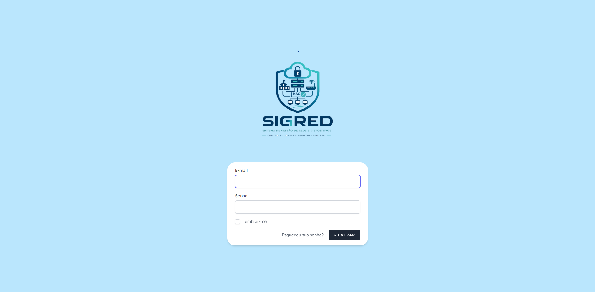
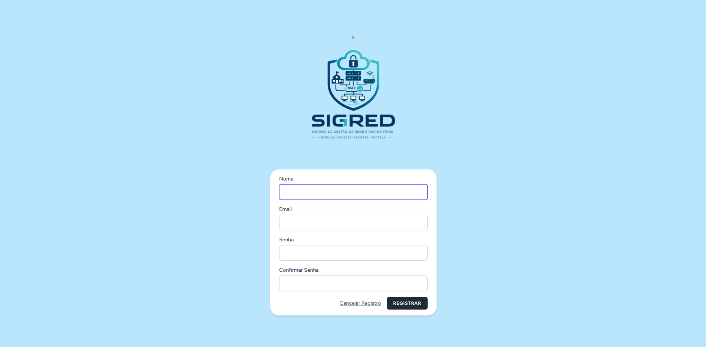
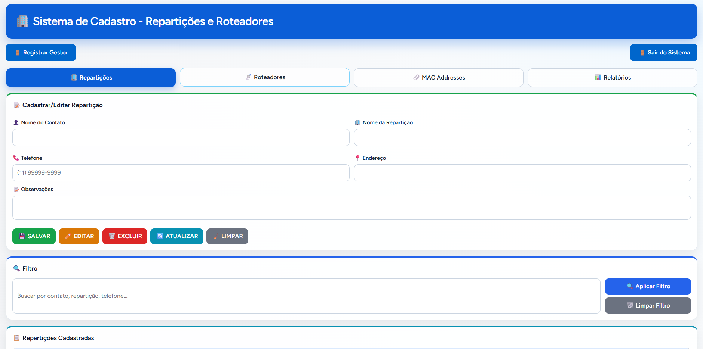
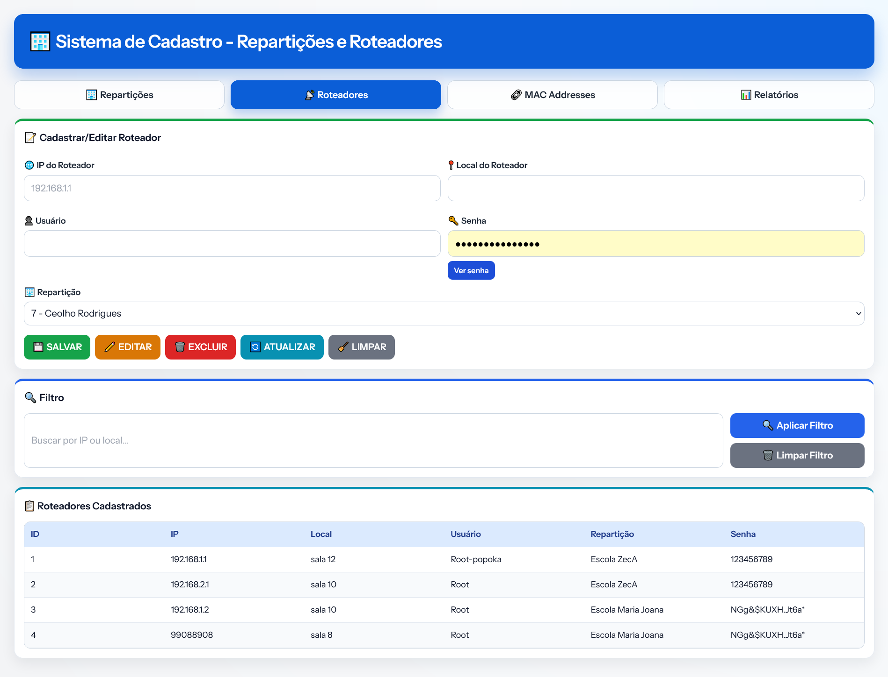
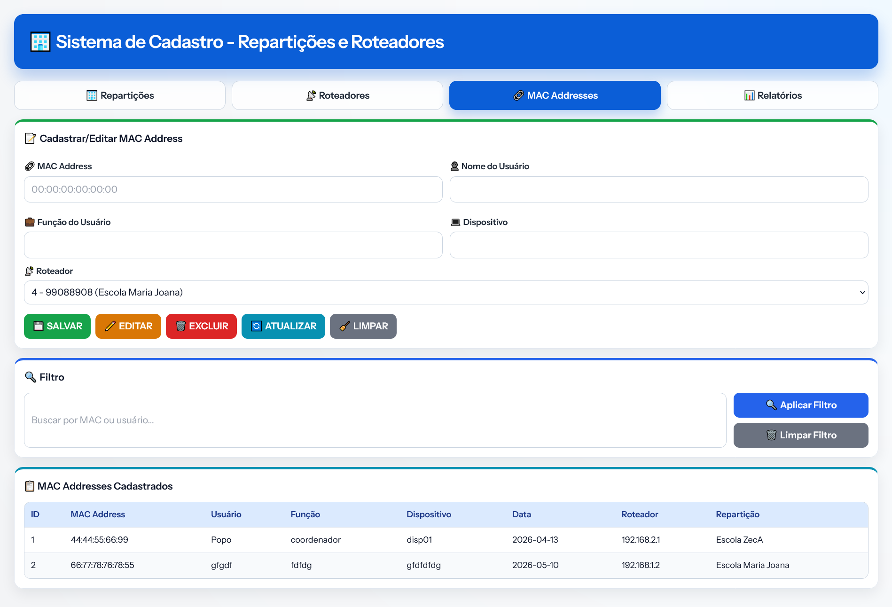
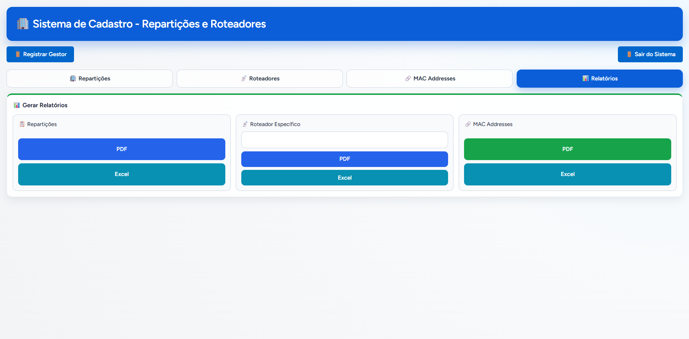

# 🌐 RedeGov - Sistema de Gestão de Ativos de Rede

[](https://laravel.com)
[](https://php.net)
[](LICENSE)

> Sistema centralizado para cadastro e gerenciamento de repartições, roteadores e dispositivos de rede.

---

## 📋 Sobre o Projeto

A gestão de ativos de rede em organizações com múltiplas unidades (repartições) apresenta desafios significativos quando realizada de forma descentralizada. Com o crescimento da infraestrutura, a quantidade de roteadores, switches e dispositivos conectados aumenta exponencialmente, tornando a administração manual, via planilhas ou documentos avulsos, suscetível a erros, inconsistências e perda de informações.

### ❌ Problemas identificados

| Problema | Impacto |
|----------|---------|
| **Localização de roteador** | Dificuldade em saber a qual repartição um determinado IP pertence |
| **Controle de acesso** | Falta de associação entre dispositivo (MAC) e usuário/função |
| **Dados descentralizados** | Ausência de registro claro sobre dispositivos conectados à rede |
| **Geração de relatórios** | Processo demorado e propenso a falhas para auditoria |

### 📊 Evidências

A falta de um sistema de gestão de ativos pode levar a:
- Aumento de até **30%** no tempo médio de resolução de problemas (MTTR)
- Dificuldade em conformidade com políticas de segurança como **ISO 27001**

---

## 🎯 Solução

Desenvolvimento de uma aplicação web que centraliza:

- ✅ Cadastro de **repartições**
- ✅ Cadastro de **roteadores** por repartição
- ✅ Cadastro de **MAC addresses** vinculados a roteadores e usuários
- ✅ Geração de **relatórios** (PDF/Excel)

---

## 🖥️ Telas do Sistema

### 🔑 Login

Realize a autenticação de usuário no sistema.

|  |
|:---:|
| *Tela de Login* |

**Funcionalidades:**
- Realização de login
- Recuperação de credenciais

---

### 📋 Registrar

Efetue o registro de novos Gestores ao sistema, acessível apenas à Administradores.

|  |
|:---:|
| *Tela de Regsitro* |

**Funcionalidades:**
- Realização de registro de Gestores

---

### 🏢 Cadastro de Repartições

Gerencie os órgãos, escolas ou unidades administrativas.

|  |
|:---:|
| *Tela de cadastro/edição de repartições com filtro e listagem* |

**Funcionalidades:**
- Nome do contato, telefone e observações
- Busca por contato, repartição ou telefone
- Listagem com ID, contato, repartição, telefone, endereço e observações

---

### 📡 Cadastro de Roteadores

Associe equipamentos de rede às repartições.

|  |
|:---:|
| *Tela de cadastro/edição de roteadores com vínculo à repartição* |

**Funcionalidades:**
- IP do roteador, usuário e senha (com opção "Ver senha")
- Vinculação a uma repartição existente
- Filtro por IP ou local
- Listagem com ID, IP, local, usuário, repartição e senha

---

### 🔌 Cadastro de MAC Address

Controle de dispositivos autorizados na rede.

|  |
|:---:|
| *Tela de cadastro/edição de MAC addresses vinculados a roteadores* |

**Funcionalidades:**
- MAC address, função do usuário
- Seleção do roteador associado
- Filtro por MAC ou usuário
- Listagem com ID, MAC, usuário, função, dispositivo, data, roteador e repartição

---

### 📊 Relatórios

Exporte dados para auditoria e planejamento.

|  |
|:---:|
| *Tela de geração de relatórios em PDF e Excel* |

**Formatos disponíveis:**
- 📄 **PDF** - Para documentação e arquivamento
- 📊 **Excel** - Para análise e manipulação de dados

**Opções:**
- Relatório completo de **Repartições**
- Relatório de **Roteador Específico** (ex: 99088908 - Escola Maria Joana)

---

## 🚀 Tecnologias Utilizadas

| Camada | Tecnologia |
|--------|------------|
| **Backend** | Laravel 11 (PHP) |
| **Frontend** | Vue.js + Inertia.js |
| **Banco de Dados** | MySQL / PostgreSQL |
| **Relatórios** | DomPDF / PhpSpreadsheet |
| **Versionamento** | Git + GitHub |

---

---

## ⚙️ Como Executar

### 📋 Pré-requisitos

Antes de começar, certifique-se de ter instalado:

- PHP 8.2+  
  Extensões necessárias:
  - `pdo_mysql`
  - `curl`
  - `json`
  - `mbstring`
  - `xml`

- Composer
- Node.js 18+
- MySQL 8.0+ ou compatível
- Git

---

## 🪟 Instalação no Windows

- PHP: https://windows.php.net/download/
- Composer: https://getcomposer.org/download/
- Node.js (LTS): https://nodejs.org/
- MySQL: https://dev.mysql.com/downloads/mysql/

---

## 🐧 Instalação no Linux/macOS

### Ubuntu/Debian

```bash
sudo apt update
sudo apt install php php-mysql php-curl php-xml php-mbstring composer nodejs npm mysql-server git
```

### macOS (Homebrew)

```bash
brew install php composer node mysql
```

---

## 🚀 Passo a Passo

### 1. Clonar o Repositório

```bash
git clone https://github.com/seu-usuario/redeGov.git
cd redeGov
```

---

### 2. Instalar Dependências PHP

```bash
composer install
```

---

### 3. Instalar Dependências Node.js

```bash
npm install
```

---

### 4. Configurar Variáveis de Ambiente

Copie o arquivo `.env.example`:

```bash
cp .env.example .env
```

Edite o arquivo `.env` com suas credenciais:

```env
DB_CONNECTION=mysql
DB_HOST=127.0.0.1
DB_PORT=3306
DB_DATABASE=redegov
DB_USERNAME=root
DB_PASSWORD=sua_senha

APP_URL=http://localhost:8000
```

---

### 5. Gerar Chave da Aplicação

```bash
php artisan key:generate
```

---

### 6. Criar Banco de Dados

```bash
mysql -u root -p -e "CREATE DATABASE redegov CHARACTER SET utf8mb4 COLLATE utf8mb4_unicode_ci;"
```

---

### 7. Executar Migrations

```bash
php artisan migrate
```

---

### 8. Compilar Assets Frontend

#### Produção

```bash
npm run build
```

#### Desenvolvimento (Hot Reload)

```bash
npm run dev
```

---

### 9. Iniciar o Servidor

Em um terminal:

```bash
php artisan serve --port=8000
```

Em outro terminal (modo desenvolvimento):

```bash
npm run dev
```

---

### 10. Acessar a Aplicação

Abra no navegador:

```txt
http://localhost:8000
```

---

# 🛠️ Troubleshooting

## Erro: `SQLSTATE[HY000] [2002] Connection refused`

Verifique:

- Se o MySQL está rodando
- Se as credenciais no `.env` estão corretas

---

## Erro: `Class 'Composer\InstalledVersions' not found`

Execute:

```bash
composer install
```

---

## Erro: `Vite manifest not found`

Execute:

```bash
npm install
npm run build
```

---

## Erro de permissão em `storage/`

### Linux/macOS

```bash
chmod -R 775 storage bootstrap/cache
```
# 📄 TERMO DE COPROPRIEDADE E USO LIVRE

Este projeto é de copropriedade de Victor Rodrigues Luz e Lizzandro Welson, sendo ambos reconhecidos como autores e detentores conjuntos dos direitos relacionados ao código-fonte, estrutura, documentação, identidade visual, banco de dados, funcionalidades, arquivos e demais componentes desenvolvidos no projeto.

Ambas as partes possuem direitos iguais, integrais e permanentes sobre o projeto, podendo utilizá-lo livremente e de forma independente, sem necessidade de autorização prévia da outra parte.

Cada coproprietário possui liberdade total para:

- Utilizar o projeto para fins pessoais, acadêmicos ou comerciais;
- Modificar, adaptar, refatorar ou expandir o projeto;
- Publicar o projeto em plataformas públicas ou privadas;
- Distribuir gratuitamente ou comercialmente;
- Vender, licenciar, sublicenciar ou doar o projeto;
- Utilizar trechos do código em outros sistemas;
- Hospedar, implantar ou manter versões próprias;
- Continuar o desenvolvimento individualmente;
- Criar derivados, versões alternativas ou produtos baseados no projeto.

Nenhuma das partes será obrigada a:

- Solicitar autorização da outra parte para uso do projeto;
- Compartilhar lucros, receitas ou benefícios obtidos individualmente;
- Prestar contas sobre modificações, distribuições ou comercializações realizadas de forma independente.

Este termo estabelece que ambos os coproprietários possuem autonomia total e irrestrita sobre o uso do projeto, sendo os direitos equivalentes para ambas as partes, como se cada um fosse integralmente proprietário do projeto para fins de utilização, exploração e distribuição.

## 📜 Licença

Este projeto está licenciado sob a licença MIT (MIT License), permitindo livre uso, cópia, modificação, distribuição, sublicenciamento e comercialização do software.

A licença MIT aplica-se ao projeto como um todo, sem restringir os direitos individuais de uso dos coproprietários definidos neste termo.

## 📌 Validade

Este acordo possui caráter permanente e aplica-se a todas as versões, atualizações e derivações relacionadas ao projeto original, salvo manifestação formal conjunta em contrário.
